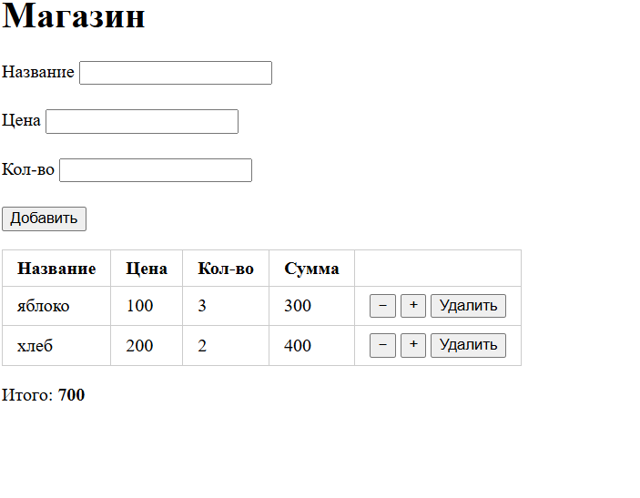

# DOM Store

## Как открыть
Открыть через Live Server в VS Code или по ссылке GitHub Pages: <ссылка>.
Двойным кликом по index.html не откроется, потому что используются ES-модули.

## Какие события я обработал
Я обработал два события. Первое, `submit` на форме: по нему я проверяю поля (имя, цена, количество) и показываю ошибки рядом с полем, а `e.preventDefault()` не даёт странице перезагрузиться при отправке. Второе, `click` на таблице: я повесил один обработчик на весь список вместо отдельных на каждую кнопку, это называется делегирование событий. Так проще, и оно работает и для строк, которые добавились уже после загрузки страницы. Нужную кнопку я нахожу через `e.target.closest('button')`, а товар определяю по `data-id` у строки. После каждого изменения вызываю `render()`, поэтому список и итого обновляются без перезагрузки.

## Скриншот

 ## ИИ
Использовал Claude: объяснение DOM и событий, примеры кода, помощь с командами git. Код и README я проверил и разобрал сам.